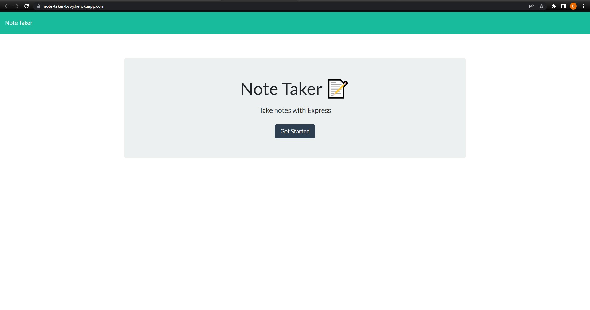
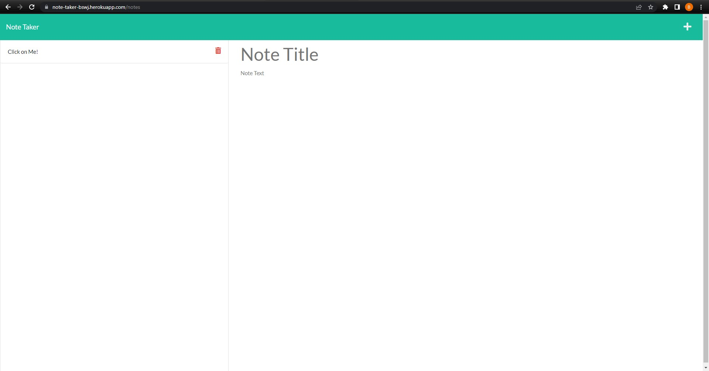
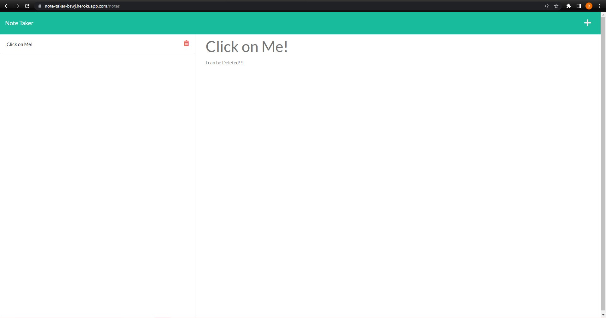

# Note Taker 

## Description

A Server side web application that allows the user to add, read, and delete notes

## Table of Contents

- [Installation](#Installation)

- [Usage](#Usage)

- [License](#License)

- [Contributing](#Contributing)

- [Tests](#Tests)

- [Questions](#Questions)

## Installation

if using the deployed application just visit the site! other wise clone the repo and install express if its not installed globally

## Usage

If using the deployed application just click the button to start! Other wise from the correct directory in the terminal type node server.

Here is an example video demonstrating how to use the application:

## License

This application is covered by : ISC

## Contributing

Below are my guidelines on how you can contribute to my project

If you would like to contribute please fork the repo and submit a pull request

## Tests

No tests for this application

### Questions

Here is my GitHub page: [https://github.com/BradsW90](https://github.com/BradsW90)

[Visit the deployed application](https://note-taker-bswj.herokuapp.com/notes)

If you would like to contact me with questions, ideas, or ways you would improve the project please click the link below!

My Email: [bswj90@gmail.com](mailto:bswj90@gmail.com)
